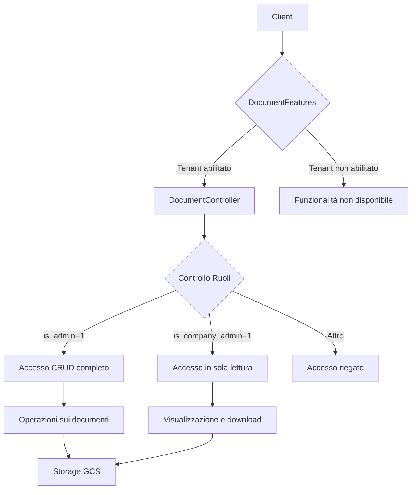

# Design Document: Sistema di Gestione Documenti

## Overview

Il sistema di gestione documenti è progettato per consentire agli amministratori di caricare, organizzare e gestire documenti associati a specifici condomini (aziende). Il sistema si basa sul meccanismo esistente di WikiObjectController, ma con funzionalità specifiche per la gestione dei documenti e controlli di accesso basati sui ruoli utente.

La funzionalità sarà disponibile solo per tenant specifici (es. Domustart) e garantirà che gli utenti possano accedere solo ai documenti associati ai condomini a cui hanno accesso.

## Architettura

Il sistema di gestione documenti seguirà un'architettura MVC (Model-View-Controller) in linea con il resto dell'applicazione Laravel:

1. **Model**: `Document` - Rappresenta un documento nel sistema
2. **Controller**: `DocumentController` - Gestisce le richieste relative ai documenti
3. **Feature Flag**: `DocumentFeatures` - Controlla l'attivazione della funzionalità per tenant specifici

### Diagramma di Flusso



## Components and Interfaces

### Model: Document

Il modello `Document` estenderà la classe `Model` di Laravel e utilizzerà i trait `HasFactory` e `Searchable` (per la ricerca tramite Laravel Scout).

```php
class Document extends Model {
    use HasFactory, Searchable;

    protected $fillable = [
        'name',
        'uploaded_name',
        'type',
        'mime_type',
        'path',
        'company_id',
        'uploaded_by',
        'file_size',
    ];

    // Relazioni e metodi...
}
```

### Controller: DocumentController

Il controller `DocumentController` gestirà tutte le operazioni CRUD sui documenti e implementerà i controlli di accesso basati sui ruoli.

Metodi principali:
- `index`: Elenco documenti (filtrato per condominio e ruolo)
- `store`: Caricamento di un nuovo documento o creazione cartella
- `downloadFile`: Download di un documento
- `destroy`: Eliminazione di un documento
- `search`: Ricerca documenti

### Feature Flag: DocumentFeatures

La classe `DocumentFeatures` gestirà l'attivazione della funzionalità per tenant specifici.

```php
class DocumentFeatures {
    public static function getFeatures(): array {
        return [
            'list',
            'upload',
            'download',
            'delete',
            'search',
        ];
    }

    public function __invoke(string $feature) {
        return match ($feature) {
            'list' => $this->canListDocuments(),
            'upload' => $this->canUploadDocuments(),
            'download' => $this->canDownloadDocuments(),
            'delete' => $this->canDeleteDocuments(),
            'search' => $this->canSearchDocuments(),
            default => false,
        };
    }

    private function isTenantAllowed(): bool {
        $current_tenant = config('app.tenant');
        $allowedTenants = config('features-tenants.documents.allowed_tenants', ['Domustart']);
        return in_array($current_tenant, $allowedTenants, true);
    }

    // Metodi per le singole feature...
}
```

## Data Models

### Document

| Campo | Tipo | Descrizione |
|-------|------|-------------|
| id | bigint | Chiave primaria |
| name | string | Nome del documento |
| uploaded_name | string | Nome del file caricato |
| type | string | Tipo (file o folder) |
| mime_type | string | MIME type del file |
| path | string | Percorso nel filesystem |
| company_id | bigint | ID del condominio associato |
| uploaded_by | bigint | ID dell'utente che ha caricato |
| file_size | integer | Dimensione del file in byte |
| created_at | timestamp | Data di creazione |
| updated_at | timestamp | Data di aggiornamento |

### Relazioni

- `Document` appartiene a `Company` (belongsTo)
- `Document` appartiene a `User` (belongsTo)

## Error Handling

Il sistema implementerà una gestione degli errori robusta:

1. **Errori di validazione**: Utilizzo del sistema di validazione di Laravel per garantire che i dati inviati siano corretti
2. **Errori di autorizzazione**: Risposte HTTP 401/403 per tentativi di accesso non autorizzati
3. **Errori di storage**: Gestione degli errori durante il caricamento/download dei file
4. **Tenant non abilitati**: Disabilitazione completa della funzionalità per tenant non autorizzati

## Testing Strategy

### Unit Testing

- Test delle singole funzionalità del controller
- Test del modello Document e delle sue relazioni
- Test della classe DocumentFeatures

### Feature Testing

- Test del flusso completo di caricamento, visualizzazione e download di documenti
- Test dei controlli di accesso basati sui ruoli
- Test della visibilità a livello di condominio

### Integration Testing

- Test dell'integrazione con il sistema di storage (GCS)
- Test dell'integrazione con il sistema di ricerca (Laravel Scout)

## Considerazioni di Sicurezza

1. **Controllo degli accessi**: Implementazione rigorosa dei controlli di accesso basati sui ruoli
2. **Isolamento dei dati**: Garantire che gli utenti possano accedere solo ai documenti dei condomini a cui sono associati
3. **URL temporanei**: Utilizzo di URL temporanei per il download dei documenti
4. **Validazione dei file**: Validazione dei file caricati per prevenire attacchi
5. **Sanitizzazione dei nomi file**: Sanitizzazione dei nomi file per prevenire attacchi di directory traversal